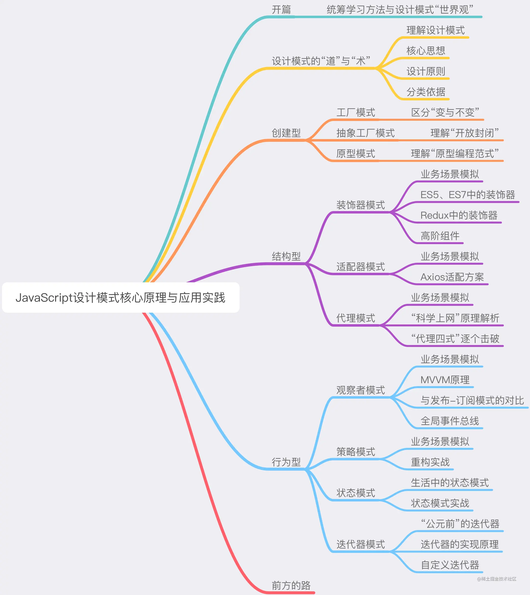
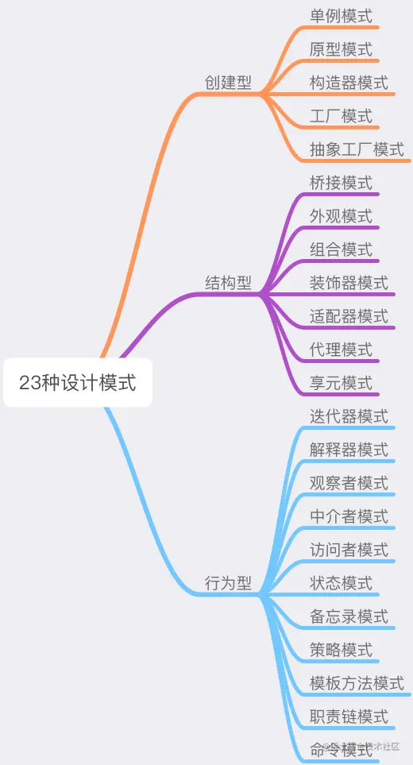

# 设计模式
S 单一职责原则

一个对象应该只包含单一的职责，并且该职责被完整地封装在一个类中，即又定义有且仅有一个原因使类变更。

（甲类负责两个不同的职责：职责A，职责B。当由于职责A需求发生改变而需要修改类T时，有可能会导致原本运行正常的职责B功能发生故障。也就是说职责A和B被耦合在了一起”）。

每个类应该只有一个变更的理由。

将不相关的功能解耦，并将它们隔离到独立的类中。

可读性、可重用性和可维护性。

O 开闭原则

可扩展不可修改

实体应该对扩展是开放的，对修改是封闭的。即可扩展(extension)，不可修改(modification)

在有可能需要变更的代码前面引入抽象。

只在需求合理可预测的情况下使用。

将代码与需求变更隔离开来。

L 里氏替换原则

一个对象在其出现的任何地方，都可以用子类实例做替换，并且不会导致程序的错误。

经典的例子: 正方形不是长方形的子类。原因是正方形多了一个属性“长 == 宽”。

这时，对正方形类设置不同的长和宽，计算面积的结果是最后设置那项的平方，而不是长*宽，从而发生了与长方形不一致的行为。

如果程序依赖了长方形的面积计算方式，并使用正方形替换了长方形，实际表现与预期不符。

在继承层次结构中定义适当的子类型非常重要

七大规则：

确定的参数（Contravariance of arguments）

确定的结果（Contravariance of result）

前置条件（Pre Conditions）

后置条件（Post Conditions）

例外规则（Exception rule）

内变规则（In-variant rule）

限制规则（Constraint rule）

对于将被其他人复用的代码尤其重要。

可以安全的使用子类。

I 接口隔离原则

接口隔离原则表明客户端不应该被强迫实现一些他们不会使用的接口，应该把胖接口中的方法分组，然后用多个接口替代它，每个接口服务于一个子模块。简单地说，就是使用多个专门的接口比使用单个接口要好很多。

ISP的主要观点如下：

1）一个类对另外一个类的依赖性应当是建立在最小的接口上的。

ISP可以达到不强迫客户（接口的使用方法）依赖于他们不用的方法，接口的实现类应该只呈现为单一职责的角色（遵循SRP原则）

ISP还可以降低客户之间的相互影响---当某个客户要求提供新的职责（需要变化）而迫使接口发生改变时，影响到其他客户程序的可能性最小。

2）客户端程序不应该依赖它不需要的接口方法（功能）。

客户端程序就应该依赖于它不需要的接口方法（功能），那依赖于什么？依赖它所需要的接口。客户端需要什么接口就是提供什么接口，把不需要的接口剔除，这就要求对接口进行细化，保证其纯洁性。
客户端应该只依赖于实际使用的功能。

最小知识和最小耦合原则。

健壮的设计，防止设计错误，更好的可读性。

D 依赖倒置原则

抽象不应该依赖于细节，细节应当依赖于抽象。换言之，要针对抽象（接口）编程，而不是针对实现细节编程。

开闭原则（OCP）是面向对象设计原则的基础也是整个设计的一个终极目标，而依赖倒置原则（DIP\)则是实现OCP原则的一个基础，换句话说开闭原则（OCP）是你盖一栋大楼的设计蓝图，那么依赖倒置原则就是盖这栋大楼的一个钢构框架。
管理抽象的使用。

通过抽象反转源代码的依赖关系。

防止变更出错，提高可重用性，减少对外部模块的依赖。

### 分类
- 创建型
    1. 单例模式
    2. 工厂模式
    3. 抽象工厂模式
    4. 原型模式
- 结构型
    1. 装饰器模式
    2. 适配器模式
    3. 代理模式
- 行为型
    1. 观察者模式
    2. 发布-订阅者模式
    3. 策略模式
    4. 状态模式
    5. 迭代器模式

### 分类
- 创建型
    1. 单例模式
    2. 原型模式
    3. 构造器模式
    4. 工厂模式
    5. 抽象工厂模式
- 结构型
    1. 桥接模式
    2. 外观模式
    3. 组合模式
    4. 装饰器模式
    5. 适配器模式
    6. 代理模式
    7. 享元模式
    8. 过滤器模式
- 行为型
    1. 责任链模式
    2. 命令模式
    3. 解释器模式
    4. 迭代器模式
    5. 观察者模式
    6. 中介者模式
    7. 访问者模式
    8. 状态模式
    9. 策略模式
    10. 模版方法模式
    11. 备忘录模式